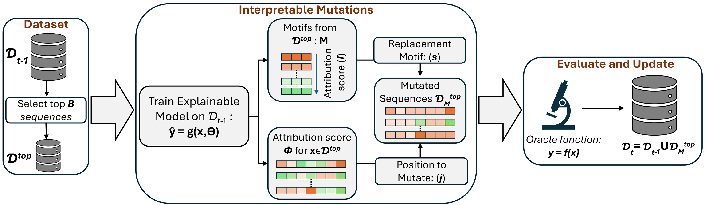

# IDEAS
Interpretability Driven Evolutionary Approach for the Design of Biological Sequences

## Overview
IDEAS is a sequence optimization framework that uses importance scores from an XAI model to guide evolutionary mutations. The importance model is retrained at each design iteration on all accumulated data, allowing it to adapt as the sequence distribution evolves.

## Architecture



## Installation

Create the conda environment:
```bash
conda env create -f environment.yml
conda activate ideas
```

```

## Usage

### Step 1: Generate/Prepare Data
To regenerate the categorical variables:
- Enter datasets/<dataset_name>
- Run make_data.ipynb
```

### Step 2: Train Importance Model (COLO)
If you need to retrain the importance model from scratch:
```bash
cd importance_models/<dataset_name>
python train_model.py --num_epochs 2500 --device cuda
```

### Step 3: Run Sequence Optimization
Run the IDEAS optimization algorithm:
```bash
cd ideas/<dataset_name>
python imp_based_motif_level.py --temp 1.0 --device cuda
```

**Arguments:**
| Argument | Type | Default | Description |
|----------|------|---------|-------------|
| `--temp` | float | 1.0 | Temperature for softmax mutation selection. Lower values = more exploitation, higher = more exploration |
| `--device` | str | 'cuda' | Device for computation ('cuda' or 'cpu') |

**What it does:**
- Loads starting pool of sequences
- Runs 10 independent trials with 10 design iterations each
- At each iteration: retrains importance model (50 epochs) on all data, then proposes new sequences
- Tests sample sizes: 20, 50, 100 sequences per batch
- Saves results to `generative_results/`

**Output files:**
- `our_{temp}.npy` - Performance metrics (mean, max fitness per iteration)
- `sequences_our_{temp}.npy` - Generated sequences
- `our_iteration_times_{temp}.npy` - Timing data

### Step 4: Analyze Results
Open and run the Jupyter notebook for comparative analysis:
```bash
cd ideas/<dataset_name>
jupyter notebook precise_score_comp.ipynb
```

This notebook calculates:
- **AUC**: Area under the optimization curve (higher = better)
- **Diversity**: Mean pairwise edit distance between generated sequences
- **Novelty**: Edit distance from generated sequences to starting pool

## Key Parameters

### In `imp_based_motif_level.py`:
```python
num_trials = 10       # Number of independent runs
rounds = 10           # Design iterations per trial
all_ng = [20,50,100]  # Batch sizes to test
retrain_epochs = 50   # Epochs for importance model retraining
motif_size = 1        # Motif size for mutations
```

## Citation

If you use this code, please cite:

```bibtex
@inproceedings{
anonymous2026textttideas,
title={\${\textbackslash}texttt\{{IDEAS}\}\$: Interpretability Driven Evolutionary Approach for the Design of Biological Sequences},
author={Akash Pandey and Wei Chen and Sinan Keten},
booktitle={Forty-third International Conference on Machine Learning},
year={2026},
url={https://openreview.net/forum?id=gaq60U4jvU}
}
```
